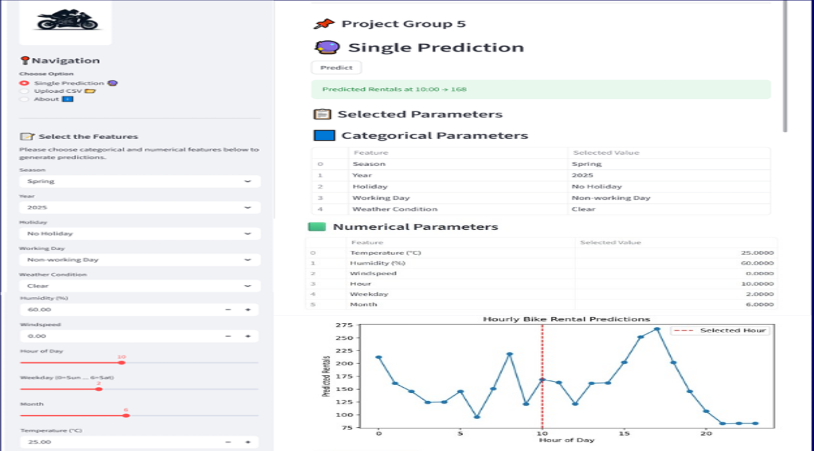

# Bike Rental Demand Prediction 

_ Accurately forecast urban bike rental demand using machine learning, data-driven insights, and scalable deployment._

---
## 📌 Table of contents
- <a href = "#overview">Overview</a>
- <a href = "#business problem">Business Problem</a>
- <a href = "#dataset"> Dataset </a>
- <a href = "#tool--technologies" >Tools & Techologies </a>
- <a href = "# project-structure"> project Structure </a>
- <a href = "#data-cleaning-- preparation" >Data Cleaning & Preparation </a>
- <a herf = "#exploratory-data-analysis- eda">Exploratory Data Analysis (EDA)</a>
- <a href = "#research-questions--key-findings">Research questions & Key Findings</a>
- <a href = "#Deployementpage">Deployement</a>
- <a href = "#How-to-run-this-project">How to run This Project </a>
- <a href = "#final-Recommendations">Final Recommendations</a>
- <a href = "#author --Contact">Author & Contact </a>

---
<h2><a class="anchor" id="overview"></a>Overview</h2>

Urban mobility depends heavily on the availability of shared bikes. This project focuses on building a machine learning solution that accurately forecasts bike rental demand by analyzing external factors such as weather conditions, seasonality, holidays, and time of day.
The goal is to ensure that bike-sharing companies can optimize operations, reduce customer waiting time, and improve overall satisfaction. By leveraging exploratory data analysis (EDA), visualization, and predictive modeling, the project uncovers demand patterns and provides actionable insights for business decision-making.

---
<h2><a class="anchor" id="business-problem"></a>Business Problem</h2>

The business problem is to ensure a stable supply ofrental bikes in urban cities by predicting the demand for bikes. By providing astable supply of rental bikes, the system can enhance mobility comfort for the public and reduce waiting time, leading to greater customer satisfaction andaccurately predicting bike demand can help bike sharing companies optimizeoperations including bike availability, pricing, strategies, and marketing efforts byconsidering demand Based on various external factors such as weather, season,holiday etc..,

---

<h2><a class="anchor" id="dataset"></a>Dataset</h2>

- CSV file located in `/data/` folder 
- Summary table created from ingested data and used form analysis

---
<h2><a class="anchor" id="tools--technologies"></a>Tools & Technologies</h2>

- Python (Pandas,numpy)
- Visualizations(Matplotlib,Seaborn)
- machine learning (sklean,XGBoost,LightGBM,Ensemble Methods)
- deployemnt (joblib,streamlit)
- GitHub

---
```
bike-rental-ml-regression/
│
├── README.md              # Project overview
├── .gitignore             # Ignore unnecessary files
├── requirements.txt       # Dependencies for Streamlit Cloud
│
├── dataset/               # Data files (keep small or sample versions here)
│   ├── bike_rental.csv
│   └── another_file.csv
│
├── outcome/               # Reports, presentations
│   └── Bike rental report.pptx
│
├── notebooks/             # Jupyter notebooks for experiments
│   └── bike-rental-model-python-ml.ipynb
│
├── scripts/               # Python scripts for pipeline + app logic
│   ├── bike_pipeline.pkl
│   └── bike_model_app.py
│
├── Deployement/           # Deployment-related assets
│   └── Bike_rental_deployment.PNG

```
---
<h2><a class="anchor" id="data-cleaning--preparation"></a>Data Cleaning & Preparation</h2>

**Data cleaning:**
- There are no duplicate rows in the dataset.
- There are unique symbols or missing values in the dataset.
- Changed the columns name for better understanding of variables. (like rec_id, datetime, year, month, hours, weather_condition, temp, atemp, humidity, count)
- Changed the data types of numerical columns which represents categories. (like season, year, month, temp, atemp, humidity, windspeed, casual, registered, count to categorical data type).

---
<h2><a herf = "#exploratory-data-analysis- eda"></a>Exploratory Data Analysis (EDA)</h2>

**Missing values:**
- There are null values in the columns, so imputed categorical features with the mode and numerical features with the median using KNN Imputer.

**Outliers Identified:**
-  outliers in the variables casual ,registered and count indicating high variability in user behaviour and demand. 
- These data points represent real-world behavior (e.g., weekend, holidays, weather shifts) and carry valuable predictive signals.
- Removing outliers was avoided as it lead to degraded model performance and loss of critical variance.
- Instead the model was trained with outliers intact to preserve data richness and improve generalization.

**Correlation Analysis:**
- Temp and atemp shows a positive correlation (0.99), so both give similar information.
- Bike rental count (count) has a strong positive relationship with both casual and registered users(0.99).

---
<h2><a class="anchor" id="research-questions--key-findings"></a>Research Questions & Key Findings</h2>

1. **WEATHER IMPACT ON HOURLY DEMAND:** Demand patterns vary significantly across weather conditions, with clear weather showing consistently higher usage during daytime hours.

2. **SEASONAL DEMAND TRENDS:** Seasonal analysis shows peak bike rentals in fall, moderate demand in summer/winter, and lowest in spring.

3. **HUMIDITY VS RENTAL DEMAND:** Bike rental demand shows periodic patterns but drops during high humidity, highlighting weather’s predictive impact.

4. **HOLIDAY IMPACT ACROSS SEASONS:** Fall contributes the largest share (~40%), summer/winter moderate (~25% each), and spring the lowest (~15%).

---
<h2><a class="anchor" id="#Deployementpage"></a></h2>

- deployemnet bike rental demand:
  - single prediction
  - upload CSV
  - About App
  


---
<h2><a class="anchor" id="how-to-run-this-project"></a>How to Run This Project</h2>

1. Clone the repository
```bash
git clone https://github.com/your-username/bike-rental-ml-regression.git
```
2.  Install dependencies
```
         pip install -r requirements.txt
```


3.  Explore the dataset
    Place the dataset (bike_sharing.csv or equivalent) in the dataset/ folder.


4. Open and run notebooks:
   - notebooks/bike_rental_prediction.ipynb

5. Run the script :
  -  python scripts/bike_model_app.py

6.Deployment : If you want to test the deployed model with a simple UI
   - streamlit run app.py   
      

---
<h2><a class="anchor" id="final-recommendations"></a>Final Recommendations</h2>

- Expand dataset with more cities for broader applicability.
- Integrate real-time weather API for live predictions.
- Deploy the model on cloud platforms for scalability.
- Enhance the UI for better user interaction and visualization.

<h2><a class="anchor" id="author--contact"></a>Author & Contact</h2>

**Praveen soni**
📧 Email: sonipraveen220@gmail.com <br>
🔗 [LinkedIn](https://www.linkedin.com/in/praveensoni7/) <br>
🔗[Streamlit](https://bike-rental-ml-regression-ps220.streamlit.app/) 